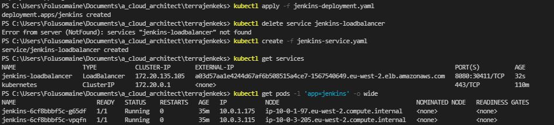
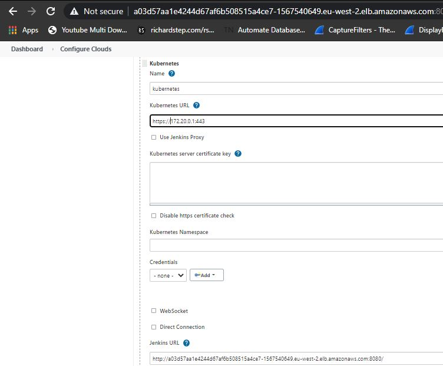
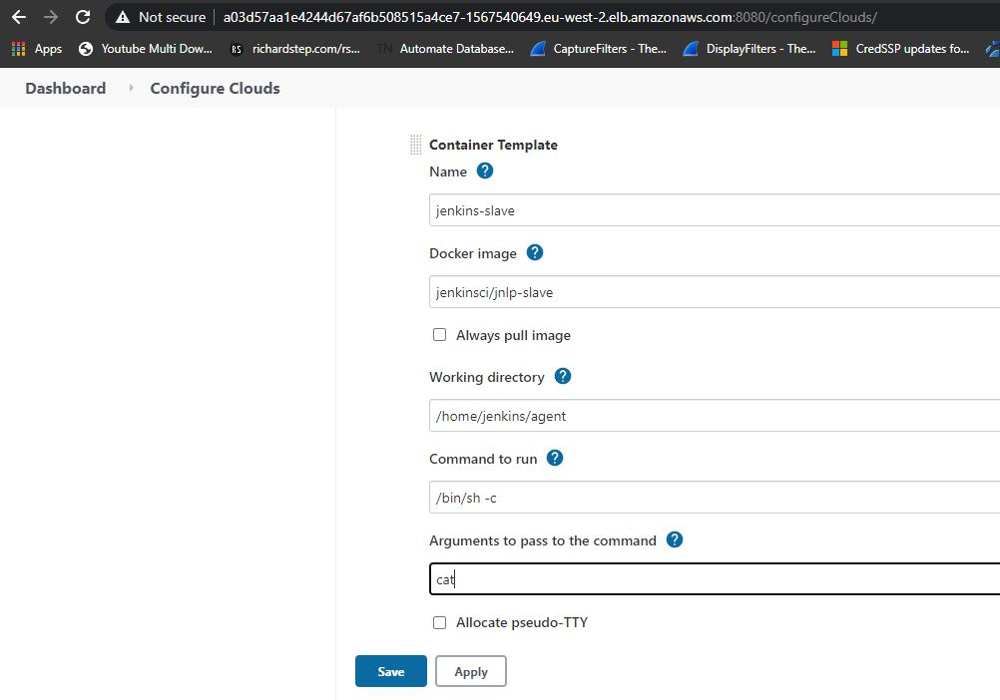

# Jenkins HA Cluster

## Introduction

This code creates a Kubernetes cluster with 2 worker nodes on AWS using Terraform.  

Jenkis Master is deployed in the cluster and exposed using AWS LB.  

Jenkins Agents are deployed from the master to run jobs using the Jenkins Kubernetes Plugins defined in the Dockerfile.  

Docker image is built locally and hosted at [`folusomaine/jenkins-eks:1.2`](https://hub.docker.com/r/folusomaine/jenkins-eks)  

## Generic Setup
### Prerequisites
* An AWS account. :smiley:
* [`AWS IAM Authenticator`](https://docs.aws.amazon.com/eks/latest/userguide/install-aws-iam-authenticator.html)
* [`AWS CLI`](https://docs.aws.amazon.com/cli/latest/userguide/install-cliv2-mac.html)
* [`Kubectl`](https://kubernetes.io/docs/tasks/tools/install-kubectl/)
* OpenSSL (Self-signed certificate)
* Terraform :innocent:  

### Steps
* Clone the repo :smiley:
```groovy
git clone https://github.com/folusomaine/terrajenkeks.git
```  
* Run the commands to provision the EKS cluster from the work directory
```groovy
terraform init
terraform plan
terraform apply
```  
* Once the cluster is live, configure Kubetcl
```groovy
aws eks --region $(terraform output -raw region) update-kubeconfig --name $(terraform output -raw cluster_name)
```  
* Apply jenkins deployment 
```groovy
kubectl apply -f jenkins-deployment.yaml
```  
* Generate a Self-signed Certificate using OpenSSL  
```groovy
openssl req -x509 -nodes -days 365 -newkey rsa:2048 -keyout privateKey.key -out certificate.crt
```  
* Convert the private key and the public certificate into .pem encoded file  
```groovy
openssl rsa -in privateKey.key -text > private.pem
openssl x509 -inform PEM -in certificate.crt > public.pem
```  
* Configure [`AWS CLI`](https://docs.aws.amazon.com/cli/latest/userguide/cli-configure-quickstart.html)  

* Upload the certicate via AWS IAM CLI (Ensure the file path is valid)
```groovy
aws iam upload-server-certificate --server-certificate-name jenkins-cert --certificate-body file://public.pem --private-key file://private.pem
```
* Obtain the ARN from the output above and update the [`jenkins kubernetes service file`](https://github.com/folusomaine/terrajenkeks/blob/master/jenkins-service.yaml).  
```groovy
# ARN of the certificate.
service.beta.kubernetes.io/aws-load-balancer-ssl-cert: <ARN>
```
* Create the jenkins service  
```groovy
kubectl create -f jenkins-service.yaml
```
* Obtain the jenkins url to access the jenkins master
```groovy
kubectl get service
```
The jenkins cluster can be accessed via `https://<EXTERNAL IP>` address
  

* Configure jenkins agents  

  

Add the Kubernetes service IP and jenkins URL  



Configure the agents using the default jenkins slave docker images `jenkinsci/jnlp-slave`  

Now we can run simultaneous builds that will provision multiple jenkins agents on multiple worker nodes.